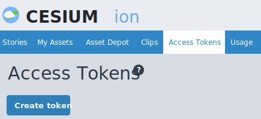
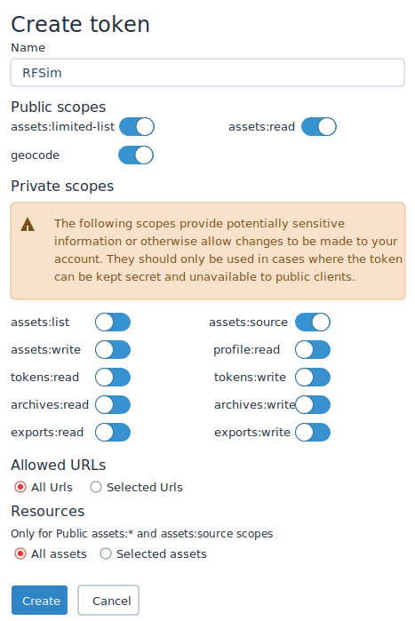
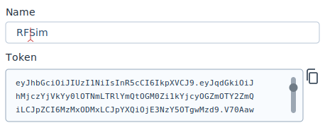
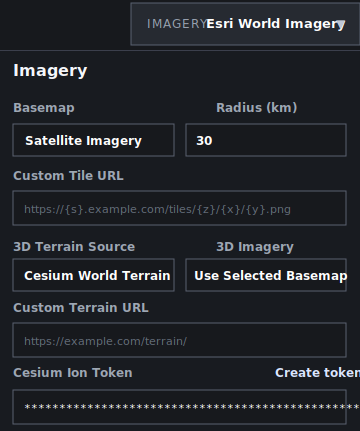

# EW / RF Propagation Simulator

EW / RF Propagation Simulator is a browser-based planning and analysis tool for building RF scenarios on a map, placing emitters and receivers, evaluating terrain-aware coverage, generating site recommendations, and reviewing the result in both 2D and 3D.

The app is primarily a static client-side application. There is no required backend service in this repo for the main mapping, terrain, planning, import/export, or visualization workflows. Most of the heavy lifting happens in the browser, including terrain sampling caches, coverage calculations, map persistence, content organization, and Cesium/Leaflet synchronization. The only optional helper service in this repo is a tiny local proxy for GenAI.mil browser access.

## What The Site Is Built To Do

The current application supports:

- 2D mapping with satellite, dark, OSM, and custom XYZ imagery
- 3D visualization with Cesium-compatible imagery and terrain
- Cesium World Terrain support when a Cesium Ion token is provided
- Client-side DTED terrain import for terrain-aware RF calculations
- Right-click terrain/elevation lookup on the map using the currently configured terrain source
- Placement of radios, jammers, relays, and receivers on the map
- Built-in and custom emitter profiles stored in the browser
- Terrain-aware coverage generation using multiple propagation models
- Point inspection of generated coverage layers for RSSI, path loss, range, line-of-sight, and terrain blockage
- Terrain-aware site planning for Tx/Rx recommendations inside a drawn planning region
- Terrain-aware 3D placement of recommended sites and direct-path 3D links between paired recommendations
- Map content management with folders, drag/reorder, focus, rename, edit, hide, and delete actions
- Drawing circles, rectangles, polylines, and polygons directly on the map
- Drag-and-drop import of GeoJSON, KML, and KMZ into editable map layers
- Export of placed emitters to GeoJSON, KML, KMZ, or a ZIP bundle containing both GeoJSON and KML
- Browser GPS and USB GPS input using the Web Serial path for NMEA devices
- Coordinate display in MGRS, lat/long, or degrees-minutes-seconds
- Configurable measurement units, themes, coordinate systems, and gridline display
- AI-assisted chat workflows that can inspect current scenario state and selected map content when a provider is configured
- Optional image attachments and browser voice-to-text for AI chat, depending on provider and browser support
- Local persistence of settings, Cesium token, profiles, AI provider selection, and map state in browser storage

## Capability Overview

### RF Scenario Authoring

You can define a scenario by placing assets on the map, importing supporting geospatial data, drawing operational shapes, and organizing everything in the `Map Contents` tree. The app keeps map content and emitter data linked so assets, imported features, coverage layers, planning outputs, and annotations all live in the same scenario space.

### Terrain And Elevation Awareness

The site can use either streamed Cesium terrain or imported DTED. That terrain is not just for rendering. It is also sampled into the analysis path so coverage generation, coverage inspection, terrain popup queries, and planning recommendations can all work from the same surface model.

### Coverage Analysis

Coverage generation produces terrain-aware grids around a selected emitter and lets you inspect specific points on the map. The point inspector reports the predicted link state for the selected location, including RF loss and visibility details rather than just drawing a color wash.

### Site Planning

The planning workflow evaluates candidate Tx/Rx placements inside a drawn polygon and ranks them based on connectivity, enemy exposure, separation, and height constraints. It is meant for terrain-informed siting exploration rather than just manual eyeballing.

### 2D And 3D Parity

Leaflet is used for fast 2D editing and overview work. Cesium is used for 3D visualization, terrain context, and terrain-aware placement review. Assets, recommendations, and terrain-backed geometry are synchronized so you can move between planning in 2D and validating in 3D.

### AI-Assisted Planning

When an AI provider is configured, the AI panel can answer questions about the active scenario, selected shapes, emitters, viewsheds, planning regions, recommendations, and other map contents. The current app serializes geometry, bounds, metrics, terrain/planning state, and context selections so the assistant can reason about actual scenario data rather than only the visible label text.

## Run The Site

This repo must be served through a local web server. Opening the HTML file directly from disk is not recommended.

Example with Python:

```powershell
python -m http.server 8080
```

Example with Node:

```powershell
npx serve .
```

Then open:

```text
http://localhost:8080
```

## Hosted Multi-User Deployment

This repo now includes a production-oriented backend scaffold under `backend/` for moving beyond browser-only local storage.

That hosted path is intended to support:

- user accounts
- multiple saved projects per user
- server-backed project persistence in PostgreSQL
- HTTPS deployment behind AWS ALB + ACM
- EC2-hosted frontend and API services with nginx in front

Key deployment files:

- `backend/`: Express + PostgreSQL API for auth and project storage
- `backend/sql/001_initial_schema.sql`: initial user/project schema
- `deploy/docker-compose.yml`: small-team deployment stack for EC2
- `deploy/nginx/default.conf`: nginx config for frontend hosting and API proxying
- `docs/aws-ec2-production.md`: AWS resource and deployment guide

If your goal is a real shared site for 10 to 20 users, this is the recommended path instead of deploying the browser-local app unchanged.

## Optional AI Proxy For GenAI.mil

The main site does not require a backend, but `genai-proxy.js` is included as an optional local helper for GenAI.mil when direct browser access is blocked by network or CORS behavior.

Start it with:

```powershell
node genai-proxy.js
```

By default it listens on:

```text
http://127.0.0.1:8787/v1/chat/completions
```

The app will try direct GenAI.mil access first and can fall back to this local proxy when needed.

## Repository Layout

Key files in this repo:

- `index.html`: the application shell, panel layout, menus, forms, and modal/popup DOM
- `styles.css`: all layout, theme, panel, top-bar, dropdown, and map UI styling
- `app.js`: the main application controller for Leaflet, Cesium, UI state, imports/exports, AI, GPS, terrain sampling, and scenario persistence
- `app-config.js`: frontend runtime config boundary for hosted API targeting
- `backend/`: backend API for auth, multi-project persistence, and future provider proxying
- `simulation-worker.js`: the worker that performs simulation, inspection, terrain-backed scoring, and planning calculations off the main UI thread
- `genai-proxy.js`: optional local proxy for GenAI.mil requests
- `deploy/`: container and nginx assets for EC2 deployment
- `docs/`: deployment and production notes
- `images/`: README support images, including the Cesium token walkthrough assets

## Architecture At A Glance

The app is organized around a browser-first architecture:

- `app.js` owns application state, event wiring, map synchronization, persistence, and UI rendering
- Leaflet handles 2D editing, feature interaction, drawing tools, and most scenario authoring
- Cesium handles globe rendering, terrain-backed 3D review, and streamed terrain sampling
- `simulation-worker.js` handles CPU-heavy simulation and planning work to keep the UI responsive
- browser `localStorage` is used for settings, map state, profiles, Cesium token storage, and AI provider configuration

This split is why the site stays responsive even when evaluating larger coverage or planning jobs.

## Cesium Setup

If you want streamed 3D terrain and Cesium-backed 3D imagery, you should configure a Cesium Ion token.

### Why You Need A Token

Cesium World Terrain is not anonymous in this app. The 3D terrain streaming path expects a valid Cesium Ion access token. Without one:

- 3D mode can still open
- the app can still use ellipsoid-only 3D mode
- DTED terrain imported into the app can still be used for propagation calculations
- Cesium World Terrain requests may fail with authorization errors

### How To Create A Cesium Ion Token

The Cesium Ion page you need is the `Access Tokens` page. Use the `Create token` button shown below.



1. Open the app.
2. Click the `Imagery` control in the top bar.
3. In the imagery dropdown, find `Cesium Ion Token`.
4. Click `Create token`.
5. Sign up for or sign in to Cesium Ion.
6. Configure the token settings on the Cesium Ion form.



Recommended settings for this app:

- Name the token something recognizable such as `RFSim`.
- Enable the public scopes needed for browser use, especially `assets:read`.
- Leave private account-management scopes disabled unless you explicitly need them for a separate private workflow.
- Set `Allowed URLs` to `All Urls` for quick local testing, or use `Selected Urls` if you want to restrict the token to your deployed app URL later.
- Leave `Resources` on `All assets` unless you are intentionally limiting the token to a smaller Cesium asset set.

For browser-based use, keep the token scoped as narrowly as practical. If you deploy this app publicly, prefer a restricted token over a broad reusable account token.

7. Create the token in Cesium Ion.
8. When Cesium shows the generated token value, use the copy button next to the token field.



9. Paste the copied token into the `Cesium Ion Token` field at the bottom of the `Imagery` dropdown in the app.



The token is stored in browser local storage for later sessions on that machine/browser profile.

### How To Use Cesium Imagery And Terrain In The App

After adding a token:

1. Open the `Imagery` dropdown.
2. Confirm `3D Terrain Source` is set to `Cesium World Terrain`.
3. Choose `3D Imagery`.
4. Click the `3D View` button in the map area.

When a token is present, the app defaults the terrain source to `Cesium World Terrain`.

### What The Imagery Dropdown Controls Do

- `Basemap`: Controls the 2D Leaflet imagery layer.
- `Radius (km)`: Used by coverage generation and terrain sampling workflows.
- `Custom Tile URL`: Lets you use a custom XYZ tile source in 2D.
- `3D Terrain Source`: Chooses ellipsoid-only, Cesium World Terrain, or a custom Cesium terrain endpoint.
- `3D Imagery`: Chooses which imagery source Cesium uses in 3D.
- `Custom Terrain URL`: Lets you point Cesium to a terrain service other than Cesium World Terrain.
- `Cesium Ion Token`: Stores the token used for Cesium Ion-backed terrain services.

## Main Interface Overview

### Top Bar

The top bar contains:

- `Imagery`: imagery, Cesium terrain, custom terrain URL, and Cesium token settings
- `Terrain`: DTED import, terrain cache status, and terrain clearing actions
- `Weather`: manual weather inputs and weather fetch actions
- `Date/Time`
- `GPS Status`: browser GPS, USB GPS, and centering controls
- `MGRS` or alternate coordinate display depending on the selected coordinate format
- `AI Chat`: provider status and panel toggle
- `Settings`: units, theme, coordinates, gridlines, and AI provider configuration

### Map Area

The map area contains:

- Leaflet map in 2D mode
- Cesium scene in 3D mode
- a `3D View` or `2D View` toggle near the zoom controls
- a compass rose in 3D mode that rotates with camera heading
- bottom-left center coordinate and elevation overlay
- bottom-right RSSI legend

### Left Panel

The left panel contains the main working controls:

- `Map Contents`
- `Emitter Profiles`
- `Emitters`
- `Simulation`
- `Site Planning`

### Right AI Panel

The right-side AI panel contains:

- provider status
- conversation history
- prompt entry
- optional image attachments
- optional voice-to-text input
- context chips representing selected or active map content

## Map Authoring And Content Management

### Map Contents

The `Map Contents` card is the main organization panel for scenario items.

It supports:

- folders
- drag-and-drop ordering
- assigning items into folders
- focusing map items
- renaming items
- editing items
- hiding items
- deleting items

Content that appears there includes:

- placed emitters
- imported GeoJSON/KML/KMZ items
- drawn shapes
- coverage layers
- planning layers and regions

### Drawing Shapes

Use the `Draw Shape` control in `Map Contents` to create:

- circles
- rectangles
- polylines
- polygons

Drawn and imported shapes can be focused, renamed, styled, edited, and included in AI context.

### Importing Existing Map Data

You can import data by dragging files directly onto the map.

Supported formats:

- GeoJSON
- KML
- KMZ

Import behavior:

- imported files create a folder based on file name
- imported features are added as editable map items
- points, lines, and polygons are supported
- imported items are added to `Map Contents`
- imported items can be focused, renamed, moved into folders, hidden, and deleted

## Emitter Profiles And Placement

Emitter profiles let you save and reuse a full emitter form configuration.

The app supports:

- built-in starter profiles
- editable saved profiles in the profile picker
- ad hoc custom saves from the emitter modal via `Save as Custom`

Profiles store values such as:

- type and force
- name and unit
- frequency and power
- antenna height and gain
- receiver sensitivity
- system loss
- icon, color, and notes

### Supported Emitter Types

- Radio
- Jammer
- Relay
- Receiver

### Typical Placement Workflow

1. Fill in the emitter fields.
2. Click `Place on Map`.
3. Click the desired location on the map.

Placed emitters:

- appear on the map
- appear in `Placed Systems`
- appear in `Map Contents`
- inherit terrain elevation at the placed location when terrain is available
- appear in 3D at terrain-aware heights

## Terrain Workflows

### Option 1: Use Cesium World Terrain

This is the streamed terrain path. Use it when you want Cesium terrain and terrain-backed planning/propagation without manually loading DTED.

Typical workflow:

1. Add a Cesium Ion token.
2. Set `3D Terrain Source` to `Cesium World Terrain`.
3. Run coverage or planning.

The app samples Cesium terrain into an internal terrain grid and caches that grid in the simulation worker so propagation and planning use the same terrain surface.

### Option 2: Import DTED

Use the `Terrain` menu in the top bar.

1. Choose a `.dt0`, `.dt1`, `.dt2`, or `.dted` file.
2. Wait for the terrain to be parsed and cached.

Imported terrain becomes available to the worker and can be used for coverage, inspection, right-click terrain lookup, and site planning.

### Clearing Terrain

Use `Clear Terrain` to remove loaded terrain and clear terrain caches associated with that terrain session.

### Right-Click Elevation Lookup

Right-click anywhere on the map to open a point popup with coordinate and elevation information for that location. When Cesium terrain is configured, the app attempts to sample the terrain source directly. When local terrain is available, the app can also use cached terrain data for that point.

## Weather

The `Weather` menu controls environmental inputs used in the propagation models.

You can:

- manually set temperature, humidity, pressure, and wind
- fetch local weather using the weather controls
- switch between metric and standard units from the settings menu

The weather state is used by the hybrid propagation mode and related attenuation calculations.

## Coverage Simulation

Use the `Simulation` card to generate coverage around a selected emitter.

### Available Controls

- selected asset
- propagation model
- receiver height
- grid step
- viewshed opacity

### Supported Propagation Modes

- `ITU-R P.525 Free Space`
- `ITU-R P.526 Terrain Diffraction`
- `ITU Hybrid Terrain + Atmosphere`

### Coverage Workflow

1. Place at least one emitter.
2. Select the emitter in `Simulation`.
3. Choose propagation settings.
4. Click `Generate Coverage`.

The app creates a terrain-aware coverage layer and adds it to the map and the coverage list.

### Inspecting Coverage

After coverage is generated, click the map while the layer is active to inspect a point.

The inspection popup reports:

- RSSI
- path loss
- range
- line of sight
- terrain blockage

## GPS And Coordinate Awareness

The top-bar `GPS Status` control opens the GPS menu.

### Browser GPS

Use `Browser GPS` to request position data from the browser Geolocation API.

### USB GPS

Use `USB GPS` to connect to a serial device that emits NMEA sentences.

This path relies on browser Web Serial support.

### GPS Centering

The GPS menu lets you choose:

- `Follow User`
- `Center Once`
- `Do Not Center`

GPS updates also feed the top-bar status and map overlays.

### Coordinate Formats

The app can display coordinates as:

- `MGRS`
- `Lat / Long`
- `Deg Min Sec`

This affects the top bar and map overlays, making it easier to switch between military-style grid workflows and conventional coordinate review.

## Site Planning

The `Site Planning` card generates recommended Tx/Rx site pairs inside a drawn planning region.

### What Planning Considers

Planning uses:

- the selected Tx and Rx assets
- enemy assets already placed on the map
- terrain, when available
- weather state
- the selected propagation model
- grid spacing and minimum separation
- detection and separation weighting
- floor and ceiling height constraints

### Planning Workflow

1. Place at least one friendly Tx and one Rx asset.
2. Optionally place enemy assets if you want enemy detection pressure included.
3. Click `Draw Region`.
4. Draw a polygon on the map.
5. Select Tx and Rx assets in the planning form.
6. Configure candidate spacing and weights.
7. Click `Recommend`.

The app evaluates candidate positions inside the polygon and returns ranked recommendations.

### Planning Outputs

The app shows:

- recommended Tx points
- recommended Rx points
- link lines between paired sites in 2D
- a recommendation summary in the panel
- recommendation entries in the planning list

When terrain is available, recommended points retain ground elevation values and are rendered in 3D at terrain-aware heights.

## 3D View

The `3D View` button in the map area toggles the Cesium globe.

### In 3D Mode

- the map switches from Leaflet to Cesium
- placed emitters render at terrain-aware heights when terrain is available
- planned Tx/Rx recommendations render at terrain-aware heights
- planning link lines render as direct 3D paths between endpoints
- the compass rose appears under the 2D/3D toggle
- clicking the compass rose resets the camera to north up

### If 3D Does Not Load Correctly

Check:

- that your Cesium Ion token is valid
- that `3D Terrain Source` is configured correctly
- that the custom terrain URL is valid if using a custom provider
- that your network can reach the selected terrain and imagery sources

## AI Planning Assistant

The right-side AI panel is optional and is only enabled when a provider and API key are configured from the settings menu.

### Supported Providers

- `GenAI.mil`
- `Anthropic (Claude)`

### What The AI Can Use As Context

The app can provide the assistant with:

- placed emitters and their RF attributes
- drawn or imported geometry
- bounds and coordinates for shapes and map items
- viewshed metadata and coverage context
- terrain and planning region state
- planning recommendations
- active or selected map content context

### AI Interaction Features

- chat history in a collapsible side panel
- explicit map-context attachment chips
- automatic inclusion of the active focused content in context
- optional pasted or attached images for providers that support them
- browser voice-to-text when supported

### AI Setup Notes

- AI provider settings are stored locally in the browser profile
- GenAI.mil direct browser access may fail depending on network conditions; when that happens, use `node genai-proxy.js`
- Anthropic image support is provider-dependent and may differ from the GenAI.mil text-first path

## Settings Menu

The settings menu controls general display and workflow preferences.

You can change:

- measurement units
- theme
- coordinate format
- gridline visibility
- gridline color
- AI provider and API key

## Export Workflows

Placed emitters can be exported from the export menu.

Supported exports:

- GeoJSON
- KML
- KMZ
- ZIP

The ZIP export bundles both GeoJSON and KML representations of the placed emitter set.

These exports include emitter metadata in feature properties or KML description content.

## Typical End-To-End Workflow

If you are new to the app, this is a good full workflow to follow:

1. Start the local web server.
2. Open the app.
3. Add a Cesium Ion token in `Imagery` if you want streamed 3D terrain.
4. Configure imagery and terrain.
5. Place one or more emitters.
6. Optionally import additional map content by dragging GeoJSON, KML, or KMZ onto the map.
7. Draw any supporting shapes or boundaries.
8. Adjust weather.
9. Generate coverage for a selected asset.
10. Click the map to inspect coverage points.
11. Right-click map locations to inspect terrain elevation.
12. Draw a planning region and run site planning.
13. Switch to `3D View` to inspect terrain-aware placements and links.
14. Organize items in `Map Contents`.
15. Optionally enable AI chat for scenario review, Q&A, or planning support.
16. Export placed emitters if needed.

## Important Notes And Limitations

- This is a browser-based planning and exploration tool, not a certified engineering package.
- Cesium World Terrain and some hosted imagery or terrain services require valid credentials and external service availability.
- 3D mode can still open even when Cesium terrain or imagery authentication is incomplete, but remote resources may fail.
- USB GPS requires browser Web Serial support and a compatible NMEA device.
- Voice input depends on browser speech-recognition support.
- DTED parsing is best-effort and client-side.
- Imported KML and KMZ support common point, line, and polygon workflows but should still be user-validated for mission-critical use.
- AI availability depends on provider credentials, browser/network behavior, and optional proxy setup for some GenAI.mil environments.

## Summary

Use this site to build a map-based RF scenario, place and organize emitters, import and draw supporting map content, sample terrain and elevation, model coverage and line-of-sight, generate terrain-aware site recommendations, inspect the result in both 2D and 3D, and optionally use AI assistance against live scenario context.